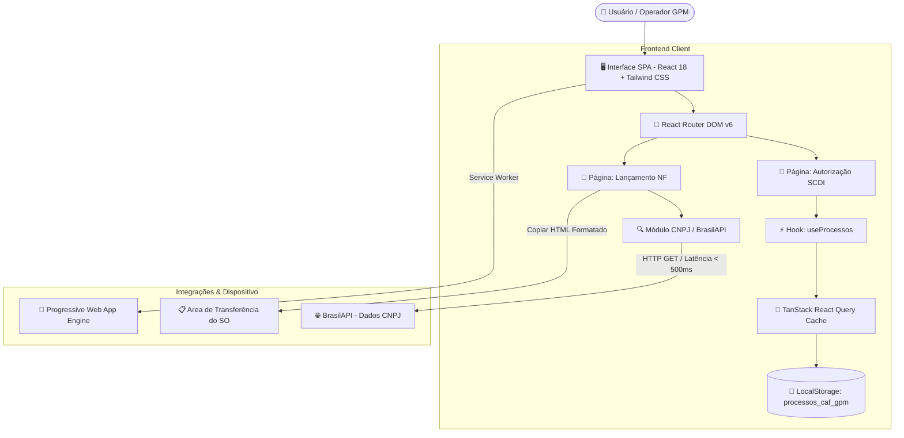

<!-- ========================================== -->
<!-- 1. CAPA                                   -->
<!-- ========================================== -->

# 🏢 Sistema CAF GPM - Gestão de SCDI & Lançamento de Notas Fiscais

[](https://github.com/)
[](https://github.com/)
[](https://github.com/)
[](https://reactjs.org/)
[](https://www.typescriptlang.org/)
[](https://vitejs.dev/)
[](https://tailwindcss.com/)
[](https://web.dev/progressive-web-apps/)

**Sistema corporativo de alta performance para emissão, acompanhamento e autorização de Solicitações de Compra Direta/Indireta (SCDI) e geração de relatórios formatados para Lançamento de Notas Fiscais (NF) no Sistema Alpha.**

* **Versão do Sistema:** `1.0.0`
* **Status:** `Ativo / Em Produção`
* **Licença:** `Proprietária Corporativa (COMPESA - GPM / CMA SUL)`
* **Última Atualização:** `27 de Julho de 2026`

---

<!-- ========================================== -->
<!-- 2. ÍNDICE                                 -->
<!-- ========================================== -->

## 📌 Índice

1. [Capa](#-sistema-caf-gpm---gestão-de-scdi--lançamento-de-notas-fiscais)
2. [Índice](#-índice)
3. [Sobre o Projeto](#-sobre-o-projeto)
4. [Principais Funcionalidades](#-principais-funcionalidades)
5. [Tecnologias Utilizadas](#-tecnologias-utilizadas)
6. [Arquitetura](#-arquitetura)
7. [Estrutura do Projeto](#-estrutura-do-projeto)
8. [Pré-requisitos](#-pré-requisitos)
9. [Instalação](#-instalação)
10. [Configuração](#-configuração)
11. [Utilização](#-utilização)
12. [Documentação Técnica](#-documentação-técnica)
13. [Banco de Dados](#-banco-de-dados)
14. [API](#-api)
15. [Segurança](#-segurança)
16. [Testes](#-testes)
17. [Contribuição](#-contribuição)
18. [Roadmap](#-roadmap)
19. [FAQ](#-faq)
20. [Suporte](#-suporte)
21. [Licença](#-licença)

---

<!-- ========================================== -->
<!-- 3. SOBRE O PROJETO                        -->
<!-- ========================================== -->

## 💡 Sobre o Projeto

### O Propósito do Sistema
O **Sistema CAF GPM** foi projetado para modernizar, padronizar e otimizar os fluxos operacionais de compras e controle fiscal das coordenações de manutenção e atendimento da **COMPESA** (CMA NORTE, CMA SUL e CMA OESTE) gerenciadas pela Gerência de Produção e Manutenção (GPM).

### O Problema que Resolve
Anteriormente, o processo de solicitação de autorizações SCDI e a solicitação de lançamento de Notas Fiscais dependiam do preenchimento manual de planilhas e e-mails despadronizados. Isso gerava:
* **Erros de digitação e inconsistências:** Erros no CNPJ, Razão Social ou cálculo do ID Fornecedor.
* **Atrasos no lançamento de NFs:** Dificuldade em formatar tabelas compatíveis com leitores de e-mail administrativos no sistema Alpha.
* **Falta de visibilidade e rastreabilidade:** Inexistência de um painel consolidado para acompanhar o ciclo de vida da requisição (*Pendente*, *Aprovado*, *Aguardando Entrega*).

### Público-Alvo
* **Coordenadores de Manutenção e Atendimento (CMA NORTE, CMA SUL, CMA OESTE)**.
* **Analistas Administrativos e Operacionais da GPM / CPR SUL**.
* **Gestores de Faturamento e Lançamento Fiscal**.

### Principais Benefícios e Diferenciais
* ⚡ **Preenchimento Automático de CNPJ:** Integração em tempo real com a **BrasilAPI** para busca automática da Razão Social.
* 🧮 **Cálculo Automático de ID Fornecedor:** Derivação direta a partir da raiz de 8 dígitos do CNPJ com acréscimo dos dígitos verificadores.
* 📧 **Cópia HTML com Formatação Corporativa:** Botão de um clique para gerar e copiar o corpo de e-mail com tabelas formatadas em HTML estilizado (`#002060`) para colagem imediata no Microsoft Outlook / Webmail.
* 📱 **Suporte Offline & PWA:** Arquitetura Progressive Web App permitindo uso continuado mesmo em áreas operacionais de campo com conexão oscilante.
* 📊 **Painel Consolidado de Estatísticas:** Indicadores numéricos de processos pendentes, valores acumulados e prazos de entrega do fornecedor.

---

<!-- ========================================== -->
<!-- 4. PRINCIPAIS FUNCIONALIDADES             -->
<!-- ========================================== -->

## 🚀 Principais Funcionalidades

### 📦 Módulo 1: Gestão de Autorizações SCDI
* **Objetivo:** Registrar e acompanhar Solicitações de Compra Direta/Indireta.
* **Funcionalidades:**
  * **Criação e Edição de Autorizações:** Formulário com suporte a múltiplos materiais, cálculo automático do valor total e validação em tempo real.
  * **Controle de Disponibilidade de Materiais:** Marcação individual de disponibilidade em *Almoxarifado*, *Estoque CD* e *Ata ARP*.
  * **Atualização Dinâmica de Status:** Transição entre *Pendente*, *Aprovado*, *Rejeitado* e *Aguardando Entrega* (com registro de data limite de entrega do fornecedor).
  * **Alternância de Visualização:** Alterna instantaneamente entre exibição em **Grade (Cards)** e **Tabela**, com persistência da preferência do usuário.
  * **Filtros e Busca:** Filtragem rápida por status e valores acoplada ao painel de resumo.
* **Regras de Negócio:**
  * Número da Requisição e Número do Processo limitados a **6 dígitos numéricos**.
  * Código do Material limitado a **10 dígitos numéricos**.
  * Todo processo deve possuir no mínimo 1 material vinculado.

---

### 🛒 Módulo 2: Solicitação de Compra ao ADM
* **Objetivo:** Permitir solicitações extraordinárias de materiais diretamente ao setor administrativo.
* **Funcionalidades:**
  * Registro de justificativa operacional estruturada.
  * Seleção opcional de itens catalogados por código ou descrição em caixa alta.
* **Regras de Negócio:**
  * A justificativa deve conter no mínimo 10 caracteres.
  * Descrições de materiais devem utilizar estritamente caracteres maiúsculos.

---

### 🧾 Módulo 3: Lançamento de Nota Fiscal (NF)
* **Objetivo:** Agilizar a montagem do e-mail oficial para lançamento da NF no sistema Alpha.
* **Funcionalidades:**
  * **Consulta On-line de CNPJ:** Busca automatizada da Razão Social via **BrasilAPI** com controle de debounce e cancelamento via `AbortController`.
  * **Geração de ID Fornecedor:** Formatação inteligente de 10 dígitos com base no CNPJ do fornecedor.
  * **Exportador HTML para Área de Transferência:** Copia o e-mail completo (Destinatários, Título, Saudação temporal e Tabela HTML com bordas e cabeçalhos corporativos).
* **Regras de Negócio:**
  * **Destinatário Padrão:** `lucidelmamiranda@compesa.com.br`
  * **Cc Fixos:** `fgoncalves@compesa.com.br, marianarezende@compesa.com.br`
  * **Título do E-mail:** `NF para Lançamento da CMA SUL/CPR SUL - GPM`

---

### 🌐 Módulo 4: PWA e Conectividade
* **Objetivo:** Garantir a resiliência operacional da aplicação.
* **Funcionalidades:**
  * Indicador visual de conectividade em tempo real (**NetworkStatusIndicator**).
  * Prompt amigável de instalação como aplicativo nativo (**PWAInstallPrompt**).
  * Armazenamento local com sincronização por revalidação do **TanStack React Query**.

---

<!-- ========================================== -->
<!-- 5. TECNOLOGIAS UTILIZADAS                 -->
<!-- ========================================== -->

## 🛠️ Tecnologias Utilizadas

| Tecnologia | Categoria | Finalidade no Projeto |
| :--- | :--- | :--- |
| **React 18** | Frontend Library | Construção da interface reativa baseada em componentes funcionais. |
| **TypeScript** | Linguagem | Tipagem estática avançada para segurança no fluxo de dados e schemas. |
| **Vite** | Build Tool | Servidor de desenvolvimento rápido e bundler otimizado para produção. |
| **Tailwind CSS** | Estilização | Design system utilitário para layout responsivo e acessível. |
| **shadcn/ui & Radix UI** | Componentes UI | Suíte de componentes acessíveis (Dialogs, Selects, Tables, Toasts, Cards). |
| **React Hook Form** | Formulários | Gerenciamento de formulários de alta performance e baixo consumo de render. |
| **Zod** | Validação | Definição de schemas rigorosos e parsing de tipos em tempo de execução. |
| **TanStack React Query** | State Management | Gerenciamento de estado de dados, cache e revalidação assíncrona. |
| **Lucide React** | Ícones | Conjunto de ícones vetoriais modernos e consistentes. |
| **BrasilAPI** | Integração API | Serviço público externo para consulta de dados cadastrais de CNPJ. |
| **SheetJS (xlsx)** | Utilitário Data | Exportação de dados e relatórios para formato de planilha Excel. |
| **Sonner** | Notificações | Sistema de alertas e toasts interativos. |

---

<!-- ========================================== -->
<!-- 6. ARQUITETURA                            -->
<!-- ========================================== -->

## 📐 Arquitetura

O sistema adota uma arquitetura **Single Page Application (SPA) desacoplada**, orientada a componentes modulares com gerenciamento de estado local via **React Query** sobre `localStorage`, garantindo total autonomia e resposta instantânea.

### Diagrama de Arquitetura Mermaid



---

<!-- ========================================== -->
<!-- 7. ESTRUTURA DO PROJETO                   -->
<!-- ========================================== -->

## 📁 Estrutura do Projeto

```text
.
├── docs/                               # 📚 Documentação Técnica detalhada do projeto
│   ├── api.md                          # Especificação das APIs e integrações
│   ├── arquitetura.md                  # Diagramas e decisões de arquitetura
│   ├── casos-de-teste.md               # Plano e matriz de execução de testes
│   ├── infraestrutura.md               # Guia de ambiente e deployment
│   ├── manual-do-usuario.md            # Guia ilustrado para operadores
│   └── requisitos-funcionais.md        # Lista oficial de Requisitos Funcionais e Não Funcionais
├── public/                             # 🌐 Arquivos estáticos e PWA
│   ├── favicon.ico
│   ├── manifest.json                   # Manifesto de configuração do PWA
│   ├── sw.js                           # Service Worker para cache e uso offline
│   └── icons/                          # Ícones do aplicativo para instalação
├── src/                                # 💻 Código fonte da aplicação
│   ├── components/                     # Componentes visuais da aplicação
│   │   ├── forms/                      # Campos de formulário reutilizáveis
│   │   ├── ui/                         # Componentes base do shadcn/ui
│   │   ├── AutorizacaoForm.tsx         # Modal de formulário para criar/editar SCDI
│   │   ├── MainLayout.tsx              # Estrutura principal da página com Sidebar
│   │   ├── NetworkStatusIndicator.tsx  # Banner visual de status da conexão
│   │   ├── ProcessoCard.tsx            # Exibição de processo SCDI em formato Card
│   │   ├── ProcessosTable.tsx          # Exibição de processo SCDI em formato Tabela
│   │   ├── PWAInstallPrompt.tsx        # Card de convite para instalação do PWA
│   │   ├── Sidebar.tsx                 # Navegação lateral
│   │   ├── SolicitacaoCompraForm.tsx   # Modal de solicitação de compra
│   │   └── SummaryPanel.tsx            # Painel com indicadores e estatísticas
│   ├── hooks/                          # Custom Hooks
│   │   ├── useNetworkStatus.ts         # Hook para monitorar estado da internet
│   │   ├── useProcessos.ts             # Hook principal de CRUD e sincronização
│   │   └── usePWAInstall.ts            # Hook para capturar evento de PWA Install
│   ├── lib/                            # Funções utilitárias e integrações
│   │   ├── cnpj.ts                     # Formatação, validação e busca BrasilAPI
│   │   └── utils.ts                    # Utilitário cn() para fusão de classes CSS
│   ├── pages/                          # Páginas / Rotas da aplicação
│   │   ├── AutorizacaoSCDI.tsx         # Dashboard e gestão de autorizações SCDI
│   │   ├── LancamentoNF.tsx            # Gerador de relatório e e-mail para NF
│   │   └── NotFound.tsx                # Tela de erro 404
│   ├── schemas/                        # Schemas Zod de validação
│   │   ├── autorizacaoSchema.ts        # Schema para autorizações e materiais
│   │   ├── lancamentoNFSchema.ts       # Schema para lançamento de NF
│   │   └── solicitacaoCompraSchema.ts  # Schema para solicitações administrativas
│   ├── types/                          # Interfaces e Tipos TypeScript
│   │   └── processo.ts                 # Definição das estruturas de dados de Processo
│   ├── App.tsx                         # Componente raiz e definição das rotas
│   ├── index.css                       # Estilos globais e diretivas do Tailwind CSS
│   └── main.tsx                        # Ponto de entrada da aplicação React
├── .env.example                        # Declaração das variáveis de ambiente
├── eslint.config.js                    # Configuração de validações do ESLint
├── metadata.json                       # Metadados do app no ambiente AI Studio
├── package.json                        # Gerenciamento de dependências e scripts npm
├── postcss.config.js                   # Configuração de pós-processamento CSS
├── tailwind.config.ts                  # Configuração do Tailwind CSS e temas
├── tsconfig.json                       # Configuração geral do compilador TypeScript
└── vite.config.ts                      # Configuração de compilação do Vite
```

---

<!-- ========================================== -->
<!-- 8. PRÉ-REQUISITOS                         -->
<!-- ========================================== -->

## 📋 Pré-requisitos

Para compilar, executar e contribuir com o projeto, certifique-se de possuir em seu ambiente:

* **Sistema Operacional:** Windows 10/11, macOS, ou Linux (Ubuntu/Debian)
* **Node.js:** Versão `v18.x` ou `v20.x` LTS
* **Gerenciador de Pacotes:** `npm` (v9.x ou superior)
* **Navegador Web:** Google Chrome, Microsoft Edge, Mozilla Firefox ou Safari com suporte a ES6 e Clipboard API.

---

<!-- ========================================== -->
<!-- 9. INSTALAÇÃO                             -->
<!-- ========================================== -->

## ⏱️ Instalação

Siga as etapas abaixo para configurar o ambiente de desenvolvimento local:

### 1. Clonar o Repositório
```bash
git clone https://github.com/sua-organizacao/sistema-caf-gpm.git
cd sistema-caf-gpm
```

### 2. Instalar as Dependências
```bash
npm install
```

### 3. Configurar Variáveis de Ambiente
Crie um arquivo `.env` baseado no modelo disponível em `.env.example`:
```bash
cp .env.example .env
```

### 4. Executar em Modo de Desenvolvimento
```bash
npm run dev
```
A aplicação estará acessível no endereço `http://localhost:3000`.

### 5. Compilar para Produção (Build)
```bash
npm run build
```
Os arquivos otimizados serão gerados dentro do diretório `/dist`.

### 6. Testar Build de Produção Localmente
```bash
npm run preview
```

---

<!-- ========================================== -->
<!-- 10. CONFIGURAÇÃO                          -->
<!-- ========================================== -->

## ⚙️ Configuração

### Arquivos de Configuração Principais

1. **`.env.example`**
   ```env
   # Porta padrão da aplicação
   PORT=3000
   ```

2. **`vite.config.ts`**
   Configurado para resolução de aliases de caminho (ex: `@/components/`) e vinculação à porta 3000.

3. **`tailwind.config.ts`**
   Personalizado com as paletas de cores institucionais do tema e extensões para componentes do **shadcn/ui**.

---

<!-- ========================================== -->
<!-- 11. UTILIZAÇÃO                            -->
<!-- ========================================== -->

## 🖥️ Utilização

### Exemplo 1: Cadastrar uma Autorização SCDI
1. Na tela **Autorização SCDI**, clique em **Nova Autorização SCDI**.
2. Informe a Requisição `123456` e o Processo `654321`.
3. Escolha a coordenação **CMA SUL**.
4. Adicione o Material: Código `102030`, Descrição `TUBOS DE PVC 100MM`, Quantidade `10`, Valor Unitário `45.50`.
5. Selecione a disponibilidade no Almoxarifado e clique em **Salvar Autorização**.

### Exemplo 2: Gerar E-mail de Lançamento de Nota Fiscal
1. Acesse o menu **Lançamento de NF**.
2. Insira o CNPJ `00.000.000/0001-91`.
3. O sistema fará a busca na **BrasilAPI**, preenchendo a Razão Social "BANCO DO BRASIL SA" e gerando o ID Fornecedor automaticamente.
4. Preencha o Número da Nota, a OC e a SCDI.
5. Clique em **Gerar E-mail** e em seguida em **Copiar para E-mail**.
6. Abra seu e-mail e cole o conteúdo formatado.

---

<!-- ========================================== -->
<!-- 12. DOCUMENTAÇÃO TÉCNICA                   -->
<!-- ========================================== -->

# 📚 Documentação Técnica

> Consulte toda a documentação técnica do projeto para compreender sua arquitetura, requisitos, processos de desenvolvimento e infraestrutura.

| Documento | Descrição | Link |
| :--- | :--- | :--- |
| **Lista de Requisitos Funcionais** | Requisitos funcionais (RF), não funcionais (RNF) e regras de negócio. | [docs/requisitos-funcionais.md](docs/requisitos-funcionais.md) |
| **Arquitetura do Sistema** | Padrões de design, fluxo de dados e diagramas estruturais Mermaid. | [docs/arquitetura.md](docs/arquitetura.md) |
| **Integração de APIs** | Documentação detalhada do consumo da BrasilAPI (CNPJ). | [docs/api.md](docs/api.md) |
| **Manual do Usuário** | Guia passo a passo com instruções completas para operadores. | [docs/manual-do-usuario.md](docs/manual-do-usuario.md) |
| **Casos de Teste** | Cenários de teste automatizados e matriz de execução. | [docs/casos-de-teste.md](docs/casos-de-teste.md) |
| **Infraestrutura e Deploy** | Instruções para conteinerização, CI/CD e execução em nuvem. | [docs/infraestrutura.md](docs/infraestrutura.md) |

---

<!-- ========================================== -->
<!-- 13. BANCO DE DADOS                        -->
<!-- ========================================== -->

## 🗄️ Banco de Dados

Atualmente, a aplicação utiliza a camada de **Persistência em Cliente (Browser Storage Engine)** baseada em `localStorage` sob a chave `processos_caf_gpm`, gerenciada pelo **TanStack React Query**.

### Estrutura do Documento JSON (`Processo`)

```json
{
  "id": "proc-1722000000000-abc12",
  "numeroRequisicao": "123456",
  "numeroProcesso": "654321",
  "coordenacao": "CMA SUL",
  "aplicacao": "Manutenção preventiva na rede de abastecimento",
  "valorTotal": 455.00,
  "status": "Aguardando Entrega",
  "prazoEntrega": "2026-08-15",
  "dataProcesso": "2026-07-27",
  "materiais": [
    {
      "codigo": "102030",
      "descricao": "TUBOS DE PVC 100MM",
      "quantidade": 10,
      "unidadeMedida": "m",
      "valorUnitario": 45.50,
      "almoxarifado": "disponivel",
      "estoqueCD": "indisponivel",
      "ataArp": "indisponivel"
    }
  ]
}
```

### Estratégia de Backup e Restauração
* **Exportação:** É possível gerar planilhas em Excel (`.xlsx`) dos processos cadastrados através das bibliotecas integradas (`xlsx`).
* **Expansão Futura:** O modelo é 100% compatível para migração direta para **Supabase (PostgreSQL)** ou **Firebase Firestore**.

---

<!-- ========================================== -->
<!-- 14. API                                   -->
<!-- ========================================== -->

## 🌐 API

A aplicação consome a API pública da **BrasilAPI** para dados cadastrais de pessoas jurídicas.

### Endpoint Utilizado
* **URL:** `GET https://brasilapi.com.br/api/cnpj/v1/{cnpj}`
* **Autenticação:** Nenhuma (API Aberta)
* **Parâmetros:** `cnpj` (14 dígitos estritamente numéricos)

### Exemplo de Resposta JSON
```json
{
  "cnpj": "00000000000191",
  "razao_social": "BANCO DO BRASIL SA",
  "nome_fantasia": "DIRECAO GERAL",
  "situacao_cadastral": 2,
  "descricao_situacao_cadastral": "ATIVA"
}
```

---

<!-- ========================================== -->
<!-- 15. SEGURANÇA                             -->
<!-- ========================================== -->

## 🔒 Segurança

* **Validação de Entrada:** Validação rigorosa em tempo de execução via **Zod**, impedindo a injeção de dados maliciosos ou desformatados.
* **Higienização de Strings:** Sanitização automática de entradas numéricas de CNPJ e códigos de processos.
* **Comunicação Segura:** Todas as chamadas de API externa utilizam protocolo `HTTPS`.
* **Clipboard API:** Uso seguro da API nativa do navegador para escrita restrita na área de transferência.

---

<!-- ========================================== -->
<!-- 16. TESTES                                -->
<!-- ========================================== -->

## 🧪 Testes

### Análise Estática de Código (Linting)
```bash
npm run lint
```

### Validação de Tipagem TypeScript
```bash
npx tsc --noEmit
```

### Verificação de Integridade de Compilação
```bash
npm run build
```

---

<!-- ========================================== -->
<!-- 17. CONTRIBUIÇÃO                          -->
<!-- ========================================== -->

## 🤝 Contribuição

Contribuições são bem-vindas! Para contribuir com o projeto, siga o padrão de desenvolvimento:

1. Faça um **Fork** do repositório.
2. Crie uma branch para sua funcionalidade:
   ```bash
   git checkout -b feature/minha-nova-funcionalidade
   ```
3. Realize os commits seguindo o padrão **Conventional Commits**:
   ```bash
   git commit -m "feat: adiciona filtro por fornecedor na tabela de processos"
   ```
4. Envie as alterações para o seu repositório remoto:
   ```bash
   git push origin feature/minha-nova-funcionalidade
   ```
5. Abra um **Pull Request (PR)** detalhando as melhorias implementadas.

---

<!-- ========================================== -->
<!-- 18. ROADMAP                               -->
<!-- ========================================== -->

## 🛣️ Roadmap

- [x] Cadastro de Autorização SCDI com adição dinâmica de materiais.
- [x] Módulo de solicitação de NF com consulta automatizada de CNPJ na BrasilAPI.
- [x] Exportação de e-mail formatado em Rich Text HTML.
- [x] Suporte PWA e indicador de status de rede em tempo real.
- [ ] Implementação de login e autenticação de usuários via SSO corporativo.
- [ ] Sincronização em tempo real de banco de dados em nuvem (Supabase / Cloud SQL).
- [ ] Leitura de Notas Fiscais em PDF por OCR automático para preenchimento de formulário.

---

<!-- ========================================== -->
<!-- 19. FAQ                                   -->
<!-- ========================================== -->

## ❓ FAQ (Perguntas Frequentes)

#### 1. Os dados salvos nas autorizações SCDI somem ao fechar o navegador?
**Resposta:** Não. Os dados são salvos com persistência local no `localStorage` do navegador do usuário e permanecem disponíveis entre sessões.

#### 2. Por que o CNPJ não preencheu a Razão Social automaticamente?
**Resposta:** Verifique se o CNPJ digitado possui 14 dígitos válidos e se o dispositivo está conectado à internet. Caso a BrasilAPI esteja fora do ar, você pode digitar a Razão Social manualmente.

#### 3. Como colar o e-mail no Microsoft Outlook sem perder a formatação?
**Resposta:** Clique no botão **Copiar para E-mail**. Abra um novo e-mail no Outlook e pressione `Ctrl + V` direto no corpo da mensagem. A tabela manterá a estilização institucional e as cores.

---

<!-- ========================================== -->
<!-- 20. SUPORTE                               -->
<!-- ========================================== -->

## 📞 Suporte

Em caso de dúvidas, sugestões ou problemas no sistema, entre em contato com a equipe responsável:

* **Responsável Operacional:** Lucidelma Miranda (`lucidelmamiranda@compesa.com.br`)
* **Equipe de Apoio Administrativo:** F. Gonçalves (`fgoncalves@compesa.com.br`) & Mariana Rezende (`marianarezende@compesa.com.br`)
* **Setor:** COMPESA - GPM / CMA SUL / CPR SUL

---

<!-- ========================================== -->
<!-- 21. LICENÇA                               -->
<!-- ========================================== -->

## 📜 Licença

Este software é de propriedade exclusiva e de uso restrito da **COMPESA (Companhia Pernambucana de Saneamento)**. Todos os direitos reservados.
