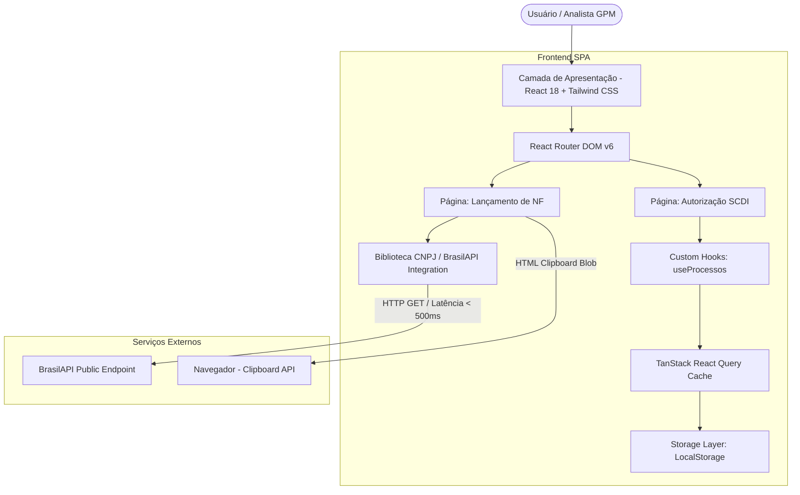

# Arquitetura do Sistema - Sistema CAF GPM

## 1. Visão Geral
O **Sistema CAF GPM** é uma aplicação Single Page Application (SPA) construída com React 18, TypeScript e Vite, utilizando arquitetura orientada a componentes modulares e desacoplados. O sistema adota o padrão Progressive Web App (PWA) para permitir utilização offline e rápido carregamento.

## 2. Diagrama de Arquitetura

## 3. Módulos Principais

1. **Pages (`src/pages/`)**:
   - `AutorizacaoSCDI.tsx`: Gestão de processos SCDI, filtros por status, estatísticas e gerenciamento de formulários modal.
   - `LancamentoNF.tsx`: Formulário de dados fiscais, integração de busca por CNPJ, cálculo de ID Fornecedor e exportador HTML de e-mail.

2. **Components (`src/components/`)**:
   - Componentes de layout (`MainLayout.tsx`, `Sidebar.tsx`).
   - Formulários específicos (`AutorizacaoForm.tsx`, `SolicitacaoCompraForm.tsx`).
   - Tabela e cards de visualização (`ProcessosTable.tsx`, `ProcessoCard.tsx`, `SummaryPanel.tsx`).
   - Componentes PWA e Rede (`PWAInstallPrompt.tsx`, `NetworkStatusIndicator.tsx`).

3. **Schemas e Validações (`src/schemas/`)**:
   - Validações estritas em tempo de execução via Zod (`autorizacaoSchema.ts`, `lancamentoNFSchema.ts`, `solicitacaoCompraSchema.ts`).

4. **Gerenciamento de Estado e Persistência (`src/hooks/useProcessos.ts`)**:
   - O estado global de processos é gerenciado via **TanStack React Query**, encapsulando operações assíncronas em cima do `localStorage` do navegador com suporte a chave `processos_caf_gpm`.
